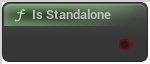

# Is Standalone

<figure><figcaption></figcaption></figure>

Standalone: a game without networking, with one or more local players. Still considered a server because it has all server functionality

<table>
<thead><tr><th width="250">Type</th><th width="200">Name</th><th>Description</th></tr></thead>
<tbody>
<tr><td>Boolean</td><td>Return Value</td><td>Standalone: a game without networking, with one or more local players. Still considered a server because it has all server functionality</td></tr>
</tbody>
</table>