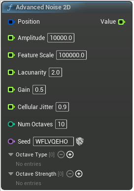

# Advanced Noise 2D

<figure><figcaption></figcaption></figure>

Generates multi-octave, highly configurable height noise for easy procedural creation

## Inputs

<table>
<thead><tr><th width="170">Name</th><th>Description</th></tr></thead>
<tbody>
<tr><td>Position</td><td>Position at which to calculate output noise</td></tr>
<tr><td>Amplitude</td><td>Height difference of the lowest and highest point of the noise's largest octave</td></tr>
<tr><td>Feature Scale</td><td>Amount of space the noise will take to tile in the world, a divisor for position</td></tr>
<tr><td>Lacunarity</td><td>A factor for how much smaller each octave's feature scale is compared to last octave's</td></tr>
<tr><td>Gain</td><td>A factor for how much smaller each octave's amplitude is compared to last octave's</td></tr>
<tr><td>Cellular Jitter</td><td>Random offset applied to cell position when using cellular noise</td></tr>
<tr><td>Num Octaves</td><td>Amount of layers this noise should have</td></tr>
<tr><td>Seed</td><td>Used to randomize the output noise</td></tr>
<tr><td>Default Octave Type</td><td>Default octave type</td></tr>
</tbody>
</table>

## Outputs

<table>
<thead><tr><th width="170">Name</th><th>Description</th></tr></thead>
<tbody>
<tr><td>Value</td><td>Result of all octaves being added together</td></tr>
</tbody>
</table>