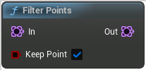

# Filter Points

<figure><figcaption></figcaption></figure>

Filter Points

<table>
<thead><tr><th width="250">Type</th><th width="200">Name</th><th>Description</th></tr></thead>
<tbody>
<tr><td>Point Set</td><td>In</td><td>In</td></tr>
<tr><td>Boolean Buffer</td><td>Keep Point</td><td>KeepPoint</td></tr>
<tr><td>Point Set</td><td>Out</td><td>Out</td></tr>
</tbody>
</table>