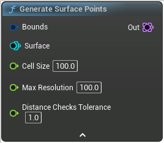

# Generate Surface Points

<figure><figcaption></figcaption></figure>

Generate points on a voxel surface

## Inputs

<table>
<thead><tr><th width="170">Type</th><th width="170">Name</th><th>Description</th></tr></thead>
<tbody>
<tr><td>Box</td><td>Bounds</td><td>Bounds</td></tr>
<tr><td>Surface</td><td>Surface</td><td>Surface</td></tr>
<tr><td>Float</td><td>Cell Size</td><td>A point will be placed in every cell the surface intersects with
This is more or less the average distance between points</td></tr>
<tr><td>Float</td><td>Max Resolution</td><td>Max surface resolution to check for
Decrease if you're missing points due to the surface being too "thin"</td></tr>
<tr><td>Float</td><td>Distance Checks Tolerance</td><td>Keep low, increase if you have missing points</td></tr>
</tbody>
</table>

## Outputs

<table>
<thead><tr><th width="170">Type</th><th width="170">Name</th><th>Description</th></tr></thead>
<tbody>
<tr><td>Point Set</td><td>Out</td><td>Out</td></tr>
</tbody>
</table>