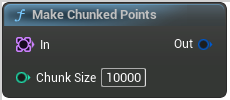

# Make Chunked Points

<figure><figcaption></figcaption></figure>

Make Chunked Points

<table>
<thead><tr><th width="250">Type</th><th width="200">Name</th><th>Description</th></tr></thead>
<tbody>
<tr><td>Point Set</td><td>In</td><td>In</td></tr>
<tr><td>Integer</td><td>Chunk Size</td><td>ChunkSize</td></tr>
<tr><td>Chunked Point Set</td><td>Out</td><td>Out</td></tr>
</tbody>
</table>