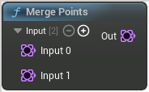

# Merge Points

<figure><figcaption></figcaption></figure>

Merge Points

## Inputs

<table>
<thead><tr><th width="170">Type</th><th width="170">Name</th><th>Description</th></tr></thead>
<tbody>
<tr><td>Point Set</td><td>Input 0</td><td>Input</td></tr>
<tr><td>Point Set</td><td>Input 1</td><td>Input</td></tr>
</tbody>
</table>

## Outputs

<table>
<thead><tr><th width="170">Type</th><th width="170">Name</th><th>Description</th></tr></thead>
<tbody>
<tr><td>Point Set</td><td>Out</td><td>Out</td></tr>
</tbody>
</table>