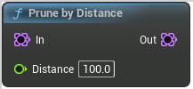

# Prune by Distance

<figure><figcaption></figcaption></figure>

Will prune any points closer to each others than Distance

<table>
<thead><tr><th width="250">Type</th><th width="200">Name</th><th>Description</th></tr></thead>
<tbody>
<tr><td>Point Set</td><td>In</td><td>In</td></tr>
<tr><td>Float</td><td>Distance</td><td>Distance</td></tr>
<tr><td>Point Set</td><td>Out</td><td>Out</td></tr>
</tbody>
</table>