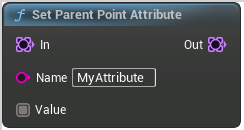

# Set Parent Point Attribute

<figure><figcaption></figcaption></figure>

Set Parent Point Attribute

## Inputs

<table>
<thead><tr><th width="170">Type</th><th width="170">Name</th><th>Description</th></tr></thead>
<tbody>
<tr><td>Point Set</td><td>In</td><td>In</td></tr>
<tr><td>Name</td><td>Name</td><td>Name</td></tr>
<tr><td>Wildcard Buffer</td><td>Value</td><td>Value</td></tr>
</tbody>
</table>

## Outputs

<table>
<thead><tr><th width="170">Type</th><th width="170">Name</th><th>Description</th></tr></thead>
<tbody>
<tr><td>Point Set</td><td>Out</td><td>Out</td></tr>
</tbody>
</table>