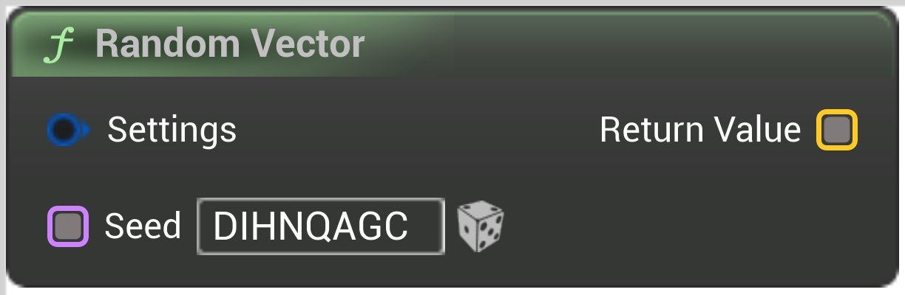

# Random Vector

<figure><figcaption></figcaption></figure>

Voxel Template Node Random Vector

## Inputs

<table>
<thead><tr><th width="170">Type</th><th width="170">Name</th><th>Description</th></tr></thead>
<tbody>
<tr><td>Random Vector Settings</td><td>Settings</td><td>Settings</td></tr>
<tr><td>Seed Buffer</td><td>Seed</td><td>Seed</td></tr>
</tbody>
</table>

## Outputs

<table>
<thead><tr><th width="170">Type</th><th width="170">Name</th><th>Description</th></tr></thead>
<tbody>
<tr><td>Vector Buffer</td><td>Return Value</td><td>ReturnValue</td></tr>
</tbody>
</table>