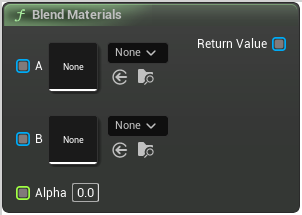

# Blend Materials

<figure><figcaption></figcaption></figure>

Blend Materials

## Inputs

<table>
<thead><tr><th width="170">Name</th><th>Description</th></tr></thead>
<tbody>
<tr><td>A</td><td>Blend Materials</td></tr>
<tr><td>B</td><td>Blend Materials</td></tr>
<tr><td>Alpha</td><td>Blend Materials</td></tr>
</tbody>
</table>

## Outputs

<table>
<thead><tr><th width="170">Name</th><th>Description</th></tr></thead>
<tbody>
<tr><td>Return Value</td><td>Blend Materials</td></tr>
</tbody>
</table>