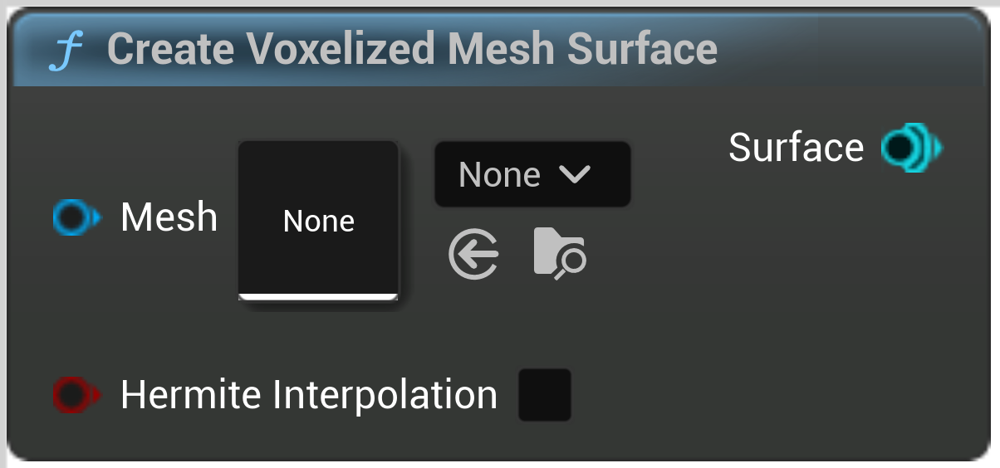

# Create Voxelized Mesh Surface

<figure><figcaption></figcaption></figure>

Creates a surface from a voxelized static mesh

## Inputs

<table>
<thead><tr><th width="170">Name</th><th>Description</th></tr></thead>
<tbody>
<tr><td>Mesh</td><td>Mesh</td></tr>
<tr><td>Hermite Interpolation</td><td>Enabling hermite interpolation can lead to higher quality results (less artifacts when interpolating), but is up to 4x more expensive</td></tr>
</tbody>
</table>

## Outputs

<table>
<thead><tr><th width="170">Name</th><th>Description</th></tr></thead>
<tbody>
<tr><td>Surface</td><td>Surface</td></tr>
</tbody>
</table>