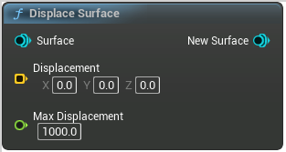

# Displace Surface

<figure><figcaption></figcaption></figure>

Displace a surface by some amount
Useful to eg add noise to a surface

<table>
<thead><tr><th width="250">Type</th><th width="200">Name</th><th>Description</th></tr></thead>
<tbody>
<tr><td>Surface</td><td>Surface</td><td>Surface</td></tr>
<tr><td>Vector Buffer</td><td>Displacement</td><td>In local space
ie, if this brush is scaled up, will increase accordingly</td></tr>
<tr><td>Float</td><td>Max Displacement</td><td>Max amount to displace by, used to compute bounds. Displacement will be clamped between -MaxDisplacement and +MaxDisplacement
Will increase bounds, so try to keep small</td></tr>
<tr><td>Surface</td><td>New Surface</td><td>NewSurface</td></tr>
</tbody>
</table>