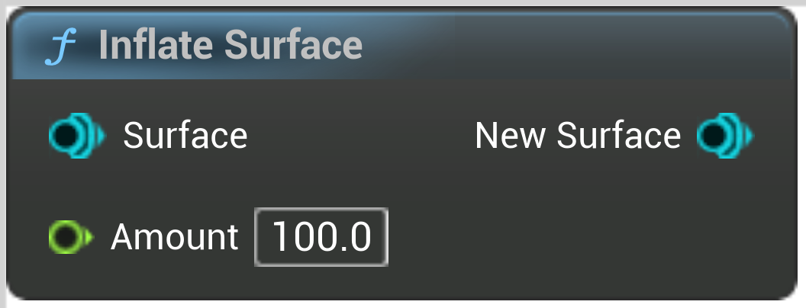

# Inflate Surface

<figure><figcaption></figcaption></figure>

Inflate a surface by a constant amount
Amount is in local space
ie, if this brush is scaled up, Amount will increase accordingly

<table>
<thead><tr><th width="250">Type</th><th width="200">Name</th><th>Description</th></tr></thead>
<tbody>
<tr><td>Surface</td><td>Surface</td><td>Surface</td></tr>
<tr><td>Float</td><td>Amount</td><td>In local space
ie, if this brush is scaled up, will increase accordingly</td></tr>
<tr><td>Surface</td><td>New Surface</td><td>NewSurface</td></tr>
</tbody>
</table>