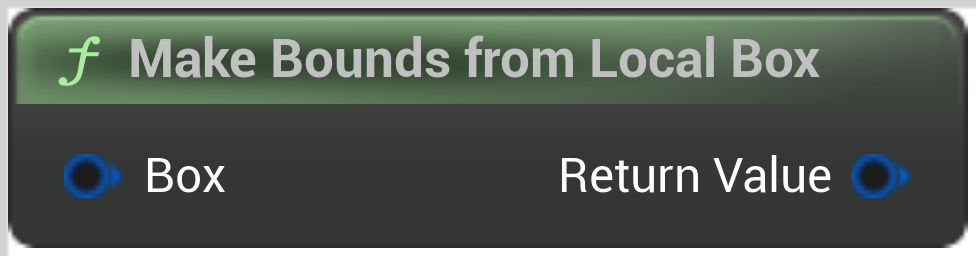

# Make Bounds from Local Box

<figure><figcaption></figcaption></figure>

Make Bounds from Local Box

<table>
<thead><tr><th width="250">Type</th><th width="200">Name</th><th>Description</th></tr></thead>
<tbody>
<tr><td>Box</td><td>Box</td><td>Make Bounds from Local Box</td></tr>
<tr><td>Bounds</td><td>Return Value</td><td>Make Bounds from Local Box</td></tr>
</tbody>
</table>