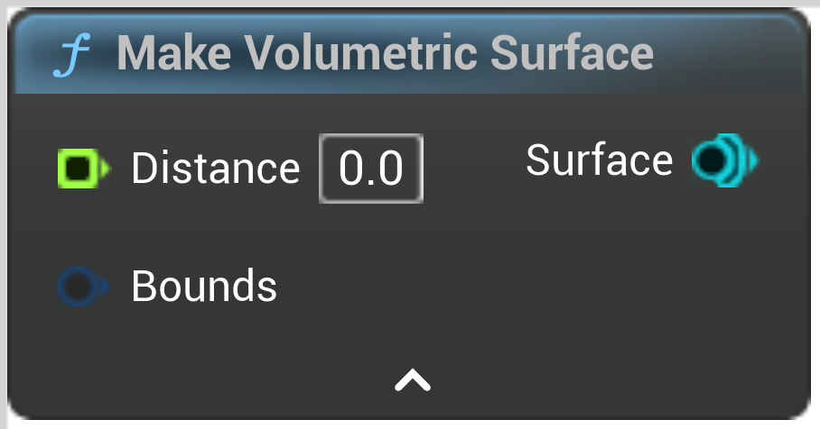

# Make Volumetric Surface

<figure><figcaption></figcaption></figure>

Make a surface from 3D distance field data

<table>
<thead><tr><th width="250">Type</th><th width="200">Name</th><th>Description</th></tr></thead>
<tbody>
<tr><td>Float Buffer</td><td>Distance</td><td>Distance</td></tr>
<tr><td>Bounds</td><td>Bounds</td><td>If not set will be infinite</td></tr>
<tr><td>Surface</td><td>Surface</td><td>Surface</td></tr>
</tbody>
</table>