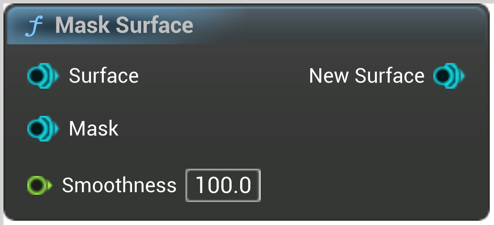

# Mask Surface

<figure><figcaption></figcaption></figure>

Mask a surface by another (ie, intersect two surfaces)
Attributes will be forwarded from Surface
Smoothness is a distance in local space
ie, if this brush is scaled up, smoothness will increase accordingly

## Inputs

<table>
<thead><tr><th width="170">Type</th><th width="170">Name</th><th>Description</th></tr></thead>
<tbody>
<tr><td>Surface</td><td>Surface</td><td>Surface</td></tr>
<tr><td>Surface</td><td>Mask</td><td>Mask</td></tr>
<tr><td>Float</td><td>Smoothness</td><td>Distance in local space
ie, if this brush is scaled up, smoothness will increase accordingly</td></tr>
</tbody>
</table>

## Outputs

<table>
<thead><tr><th width="170">Type</th><th width="170">Name</th><th>Description</th></tr></thead>
<tbody>
<tr><td>Surface</td><td>New Surface</td><td>NewSurface</td></tr>
</tbody>
</table>