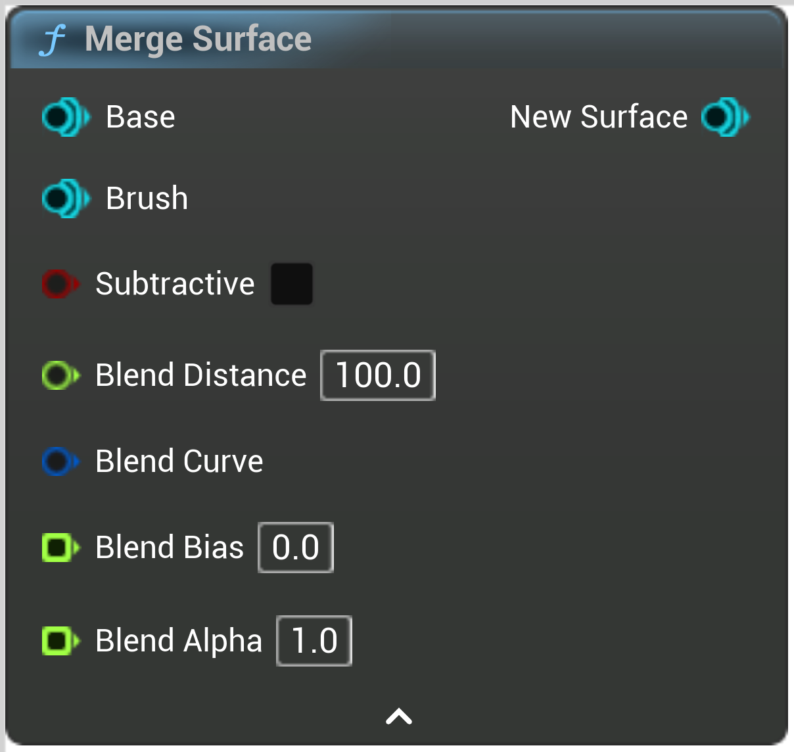

# Merge Surface

<figure><figcaption></figcaption></figure>

Merge Surface

<table>
<thead><tr><th width="250">Type</th><th width="200">Name</th><th>Description</th></tr></thead>
<tbody>
<tr><td>Surface</td><td>Base</td><td>Base</td></tr>
<tr><td>Surface</td><td>Brush</td><td>Brush</td></tr>
<tr><td>Boolean</td><td>Subtractive</td><td>Subtractive</td></tr>
<tr><td>Float</td><td>Blend Distance</td><td>In local space
ie, if this brush is scaled up, BlendDistance will increase accordingly</td></tr>
<tr><td>Curve</td><td>Blend Curve</td><td>Use this to customize the shape of the blend
Input and output are between 0 and 1
Must have Y=0 at X=0 and X=1
If not set defaults to Y = X * (1 - X)</td></tr>
<tr><td>Float Buffer</td><td>Blend Bias</td><td>Usually between -1 and 1, useful to displace the blend</td></tr>
<tr><td>Float Buffer</td><td>Blend Alpha</td><td>Used to blend the attributes
0 = Base
1 = Brush
Use GetMergeData to get the smooth alpha</td></tr>
<tr><td>Surface</td><td>New Surface</td><td>NewSurface</td></tr>
</tbody>
</table>