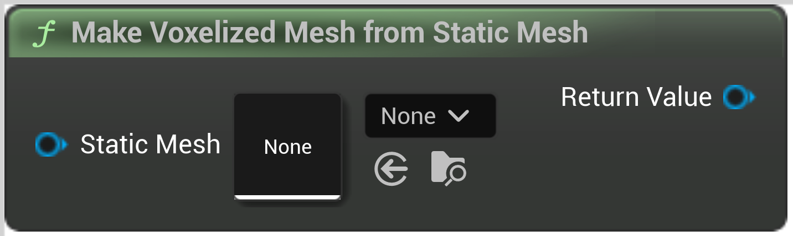

# Make Voxelized Mesh from Static Mesh

<figure><figcaption></figcaption></figure>

Make Voxelized Mesh from Static Mesh

## Inputs

<table>
<thead><tr><th width="170">Name</th><th>Description</th></tr></thead>
<tbody>
<tr><td>Static Mesh</td><td>Make Voxelized Mesh from Static Mesh</td></tr>
</tbody>
</table>

## Outputs

<table>
<thead><tr><th width="170">Name</th><th>Description</th></tr></thead>
<tbody>
<tr><td>Return Value</td><td>Make Voxelized Mesh from Static Mesh</td></tr>
</tbody>
</table>