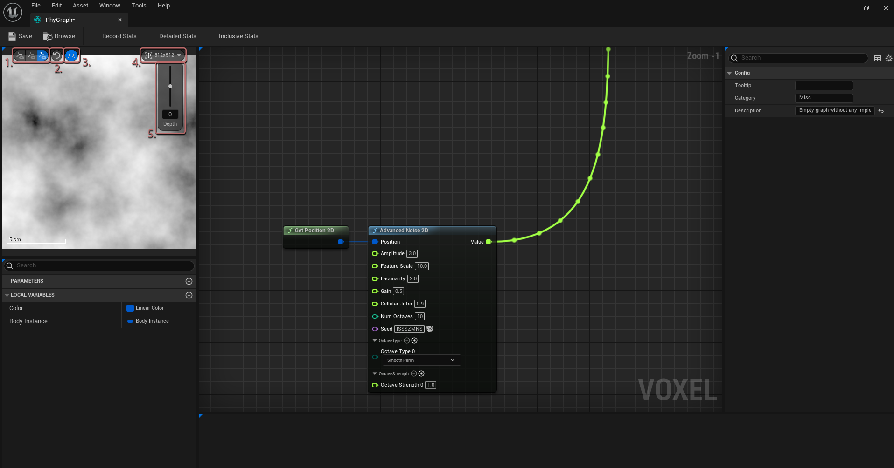

# Using the MetaGraph Preview

When a graph is created and first opened, there are no nodes and the preview is therefore inactive. Once nodes have been placed, right-click any pin and click "Preview this node". The preview window in the top-left of the graph editor will update to show the data at the selected pin. The wires connected to this pin will get a bubble-flow effect to indicate its active preview status. &#x20;

<figure><figcaption></figcaption></figure>

The preview window has several controls at the top. Their respective functions, as numbered in the above image, are:

1. These three buttons control which axis the world is viewed from, th X, Y or Z plane. This can be useful when getting trying to get a view of volumetric terrain shapes. For 2D data, keeping it on the Z plane, the third option, is best.&#x20;
2. To reset the view to world origin. This is useful if the preview is very far from origin, and needs to be brought back.
3. To toggle preview normalization. This takes the lowest and highest value computed for the preview, and remaps them to 0 and 1 in the final image. This should be disabled when trying to preview absolute values, but is very useful for previewing terrain height and noise, as these are generally large values which go lower than 0 and higher than 1.
4. Controls the resolution at which the preview is rendered. Lower resolutions give higher performance as the preview is moved around, but will look grainy when the preview is large on-screen. &#x20;
5. This slider applies an offset along the current axis, this can be useful when previewing densities, as it allows you to easily visualize where the surface is across a few vertical slices of the terrain.

&#x20;

Hovering over the preview will show the value underneath the mouse position as tooltip.,

By default, the preview window has a ruler in the bottom-left. Additionally, holding middle-mouse button will create a distance measurement between two points on the preview.&#x20;
