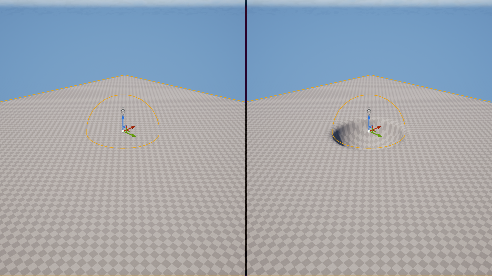

# Execution Order, Layers & Priority

All stamps in the `world` are processed one-by-one in a specific order. The order decides which stamps' effects are most visible, and how their blends are applied.&#x20;

## An Example of Why This Matters

If there are two stamps in the world, one additive plane and one subtractive sphere. The result will be very different depending on which is applied first or last.

If the additive plane is applied first, and the subtractive sphere is applied second, the terrain will be a plane with a sphere carved out. If instead the subtractive sphere is applied first, and additive plane is second, the sphere will be subtracted while there's no surface to subtract from, and then the plane will add itself over top. The terrain will just be a plane in the end.

<figure><figcaption>
Both sides are the same stamps, but on the left, the subtractive sphere is applied first, while on the right, the plane is applied first. 
</figcaption></figure>

Because of this, it's important to understand in what order stamps are processed, and how you can control that order.

## Controlling Execution Order using Layers & Priority


Add new layers by creating Height/Volume Layer assets, and adding them to a Voxel Stack.&#x20;

Make sure your voxel world (and queries if you have them) are using the right stack!


Layers and priority are both properties on any stamp you place, which control what order they are applied in. Layers often aren't _needed_, but they tend to be less messy for large world with many different kinds of stamps.


Systems that sample voxel data, like PCG's `Voxel Sampler` node and the `Voxel Query` Blueprint node, use layers to know which stamps to consider.&#x20;

Because of this, adding layers _is_ necessary for more advanced workflows (i.e. scattering stamps using PCG).&#x20;


Within a layer, priority controls the order of stamps. The stamp with the lowest priority number is applied first, and the stamp with the highest priority is applied last. This means the highest priority stamp will be 'most visible'.

Note that priority only matters for stamps on the same layer. Across layers, the layer at the top of a stack is applied first, with any stamps in the layer below it being blended on top of the first layer. You may use a layer for your base terrain, for example, and a second layer for your caves - forcing all your caves to be applied _after_ your base terrain, without needing to set the right priority values.


**For example:**&#x20;

If Stamp1 has a `Priority` of 0, and Stamp2 has a `Priority` of 10, Stamp2 will appear over top of Stamp1. This is because Stamp1 is processed first, and Stamp2 is processed second.

If `LayerA` is the first entry in the stack, and LayerB is the second, **any** stamps assigned to LayerB (regardless of their priority) will appear over top of stamps from LayerA. This is because LayerA is processed first, and LayerB is processed second.&#x20;

Putting Stamp2 on `LayerA` , for example, and Stamp1 on LayerB, would lead to `Stamp1` being on top, despite its higher priority.

