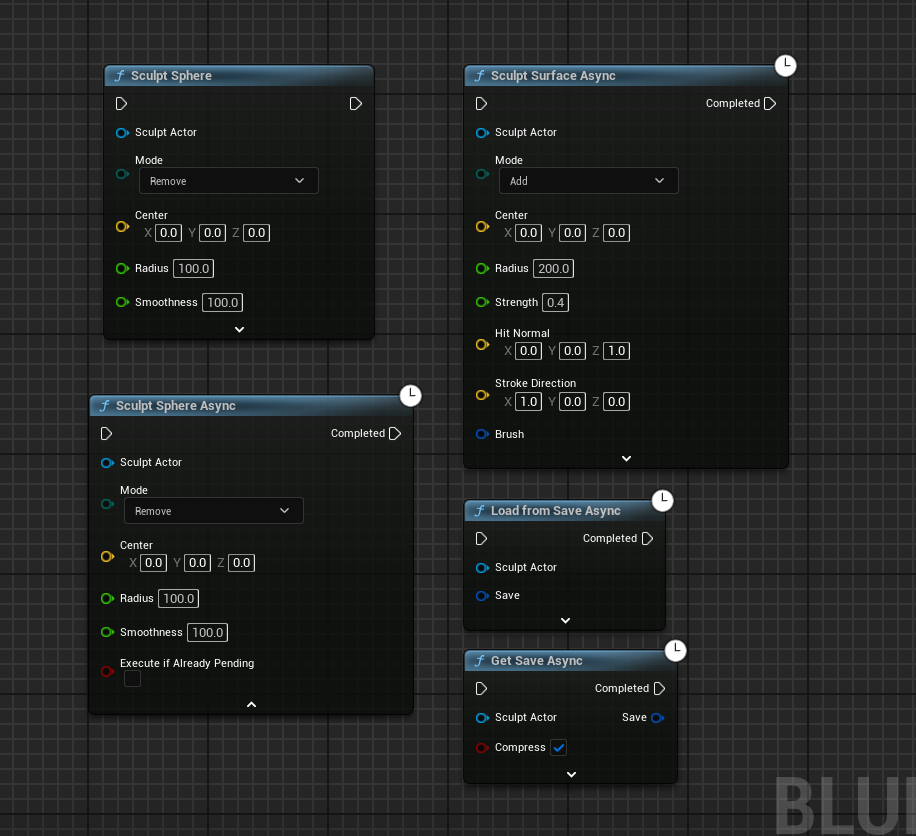

# 2.0p-340 Release Notes

[https://github.com/VoxelPlugin/VoxelPlugin/tree/2.0p-340.0](https://github.com/VoxelPlugin/VoxelPlugin/tree/2.0p-340.0) - Released October 2 2023

This release drops 5.1 support and adds 5.3 support.

## **New features**

### New material pipeline

The new voxel material pipeline is now ready, letting you assign materials per voxel. You can have up to 3 different materials per "texel" (ie,  per detail texture pixel). Rendering supports blending up to 3 materials as well.

You can have a few thousands of materials per chunk. The only limitation is that voxel materials need to all inherit from the same material definition: each voxel material can have its own parameters (float/textures), but the material logic needs to be shared between all of them.

For more details see [Material Definitions](../knowledgebase/surfaces-and-materials/material-definitions/) and the Complex Material [example](../getting-started/installing-voxel-content.md).

<figure><figcaption>
The Voxel Material Definition is where you can declare your parameters 
</figcaption></figure>

 

<figure><figcaption>
You can override these parameters in Voxel Material Definition Instances
</figcaption></figure>

<figure><figcaption>
You can access the Material Definition parameters directly in your material
</figcaption></figure>

 

<figure><figcaption>
You can set materials directly in your graph. They're automatically blended by Smooth Union.
</figcaption></figure>

### New foliage pipeline

Foliage has been refactored into a point-based spawning system, following design patterns similar to Unreal's PCG. Existing foliage graphs will be broken, you will need to manually migrate to the new system. See [Foliage](../knowledgebase/foliage.md) and the LandmassFoliage [example](../getting-started/installing-voxel-content.md).


Quickly tuning some tree slope settings using the new inline curves. Foliage is using the same ISPC backend as regular plugin compute, making is extremely fast.


<figure><figcaption>
Points are generated directly from a Voxel Surface
</figcaption></figure>

#### Collision

This pipeline supports invoker-based collision and has been stress tested in large projects: collision is only generated near invokers to reduce the load on the Chaos scene and avoid hitching. The new invoker system is designed to support up to 500 invokers to allow adding one to every gameplay object.

#### Interaction

You can use `MakePointHandle` to get a point handle from a hit result. This handle is globally unique, replicable, serializable into save games & can be sent through RPCs.

With this handle, you can edit point attributes at runtime: you can change a point scale, location, or even set more complex attributes & react to them in your graph.

<figure><figcaption>
Setting HasBerries to false on a point if IsHarvestable is true
</figcaption></figure>

<figure><figcaption>
Rendering a different mesh if HasBerries is true. Render will automatically update when SetPointAttribute is called in blueprints. ApplyPointStorage applies all the SetPointAttributes.
</figcaption></figure>

### New sculpt pipeline

The sculpt pipeline is now close to being ready

Example

How it works: Set Source, Get Sculpt, Edit Surface

### Curve improvements

Sampling curves now uses SIMD logic, making them 10x faster than previous curve sampling logic.

You can now define curves inline without having to make a new asset for each curve.

### Parameter override tickboxes

* You can now selectively override parameters in instances, with a tickbox similar to material instances
* Existing parameters will be automatically enabled.

### New exec flow

* All exec nodes (red nodes) now have an optional execution pin
* Exec nodes in the main graph that have their exec pin unplugged will be executed automatically
* You can use the Execute node to call exec nodes that are located in macros
* You can use the Select node on execution wires to selectively enable/disable parts of your graphs

### Detail texture improvements

* Detail textures are now pooled into large textures
  * This reduces render thread cost when voxel chunks are updated
  * Use `stat voxelmemory` to see detail texture memory usage
* You can easily sample detail textures in materials using the new SampleVoxelFloatDetailTexture node
* You can easily assign detail textures in graphs using SetSurfaceAttribute and BindFloatAttributeDetailTexture

### Graph preview is fixed, new graph debug

* Use R on any node to preview its output
* Press D to debug a node
* For marching cube: will output the node value as color on the mesh itself
* For foliage: will preview the points at that stage

### New graph stats & Compile All button

<figure><figcaption></figcaption></figure>

## Technical notes

* New task bypass option to make it easier to debug voxel task: pass -VoxelBypassTaskQueue or use voxel.BypassTaskQueue
* VOXEL\_ON\_COMPLETE doesn't take a Thread anymore. Use VOXEL\_ON\_COMPLETE\_GAMETHREAD to run on the game thread
* SceneNode are now ExecNodes
* You can use -checkVoxelNaNs or voxel.CheckNaNs to raise ensures whenever a NaN is generated
* DEFINE\_VOXEL\_NODE is now DEFINE\_VOXEL\_NODE\_COMPUTE
* On runtime shutdown, the game thread will stall until all voxel tasks are completed or cancelled.  This shouldn't create major hitches and will help having cleaner logic in subsystems.
* The move to Channel Registry assets means we need to wait for them to be loaded before creating any voxel runtime. See `FVoxelRuntime::CanBeCreated`
* Dense/morton-order position queries are now gone as using them to computed derivatives proved inaccurate
* Foliage FVoxelPointId are technically only unique within a single foliage chunk. FVoxelPointHandle is globally unique.
* You can now use the `ConstantPin` tag in exec node pins. This will compute the pin value before the exec node runtime is created and will recreate the runtime on value change. Use `GetConstantPin(Node.PinName)` to get the pin value in the exec runtime.
  * This replaces DECLARE\_VOXEL\_PIN\_VALUES which is now removed
* Any allocation done inside a `VOXEL_FUNCTION_COUNTER` will have the voxel LLM tag
* The rotator pin type has been removed and Quaternion pins now break into euler angles instead
* You can now use the voxel.get and voxel.set console commands to easily set voxel parameters at runtime
* All voxel singletons now inherit from FVoxelSingleton and are destroyed on shutdown
  * This helps with memory leak detection as we can now ensure that all allocations made through the voxel allocator are freed on shutdown
  * This might cause crashes if you try to access any voxel singleton after the voxel module is unloaded (typically through an async task)
* FVoxelTicker is now manually registering instances and they are all ticked together in FVoxelTickerManager::Tick
* This release includes multiple bug fixes for running Unreal on a Linux system with Vulkan
* `VOXEL_CONST_CAST` is now `ConstCast`
* `voxel.StartInsights` and `voxel.StopInsights` can be used to easily start/stop an insights capture with the right settings.
* To quickly hide a point, use `SetPointVisibility`. This will bypass the attributes & hide the point/disable its collision with at most a one frame delay.
* When attributes are changed, new foliage instances will be detected & rendered through an `UInstancedStaticMeshComponent` to not trigger a full rebuild of the `UHierarchicalInstancedMeshComponent` tree. Instances will be removed by setting their scale to 0. If too many instances are changed at once, a full rebuild is triggered.

## **Migration notes**

* You can now use the Compile All button in graphs to easily see graphs with errors
* Exposed Data nodes are gone - please use Register to Channel/Query Channel instead
* Voxel Scene, Voxel Brush and Voxel Foliage graphs are now all Voxel Graphs
  * They will be automatically migrated
  * Voxel Meta Actor and Voxel Brush Actor are now Voxel Actor
* The Distance pin type is gone and is replaced by Surfaces
  * Surfaces are a high-level way of defining 3D shapes
  * Make Height Distance is now Make Height Surface
  * To create a surface from a SDF, use Create Volumetric Surface
  * See [Working with Surfaces](../knowledgebase/surfaces-and-materials/working-with-surfaces/)
* Voxel Channel are now project settings and can also be defined in Channel Registry assets. Existing channels & their references will be automatically migrated to the new system.
* Density Canvases are gone and replaced by sculpt surfaces
* Foliage nodes are broken and will need to be migrated to the new system
* Voxelized Mesh Assets will have their VoxelSize reset to 20cm
  * This is due to the removal of the project settings BaseVoxelSize
* Physics Scene are removed, you can now directly use the Generate Marching Cube Collision & Navmesh node
* The Graph property of Voxel Components is now private. You'll need to use the `Set Graph` function
* `ConstructBrush`/`UpdateBrush`/`DestroyBrush` are now `CreateRuntime`/`DestroyRuntime`. `UpdateBrush` doesn't need to be called anymore when moving a voxel brush.
* Local Variables must always have a declaration now. Existing local variables without a declaration will have one added on load at the center of the graph.
* The `Voxel/MaterialFunctions` content folder has been entirely removed. If you are missing material functions, copy them over from a previous voxel release.&#x20;
