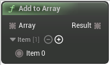

# Add to Array

<figure><figcaption></figcaption></figure>

Add series of items to array

## Inputs

<table><thead><tr><th width="170">Name</th><th>Description</th></tr></thead><tbody><tr><td>Array</td><td>Array</td></tr><tr><td>Item 0</td><td>Item</td></tr></tbody></table>

## Outputs

<table><thead><tr><th width="170">Name</th><th>Description</th></tr></thead><tbody><tr><td>Result</td><td>Result</td></tr></tbody></table>
