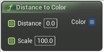

# Distance to Color

<figure><figcaption></figcaption></figure>

Distance to Color

## Inputs

<table><thead><tr><th width="170">Name</th><th>Description</th></tr></thead><tbody><tr><td>Distance</td><td>Distance</td></tr><tr><td>Scale</td><td>Scale</td></tr></tbody></table>

## Outputs

<table><thead><tr><th width="170">Name</th><th>Description</th></tr></thead><tbody><tr><td>Color</td><td>Color</td></tr></tbody></table>
