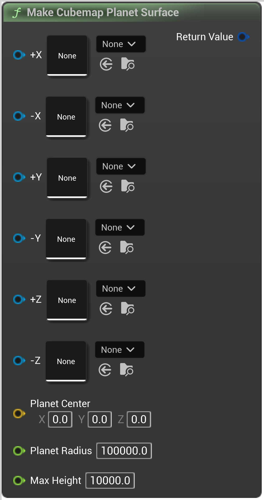

# Make Cubemap Planet Surface

<figure><figcaption></figcaption></figure>

Creates a planet from 6 heightmaps All the heightmaps should have the same size All the heightmap settings will be ignored - heightmap values will be between 0 and MaxHeight

## Inputs

<table><thead><tr><th width="170">Name</th><th>Description</th></tr></thead><tbody><tr><td>Pos X</td><td>Creates a planet from 6 heightmaps All the heightmaps should have the same size All the heightmap settings will be ignored - heightmap values will be between 0 and MaxHeight</td></tr><tr><td>Neg X</td><td>Creates a planet from 6 heightmaps All the heightmaps should have the same size All the heightmap settings will be ignored - heightmap values will be between 0 and MaxHeight</td></tr><tr><td>Pos Y</td><td>Creates a planet from 6 heightmaps All the heightmaps should have the same size All the heightmap settings will be ignored - heightmap values will be between 0 and MaxHeight</td></tr><tr><td>Neg Y</td><td>Creates a planet from 6 heightmaps All the heightmaps should have the same size All the heightmap settings will be ignored - heightmap values will be between 0 and MaxHeight</td></tr><tr><td>Pos Z</td><td>Creates a planet from 6 heightmaps All the heightmaps should have the same size All the heightmap settings will be ignored - heightmap values will be between 0 and MaxHeight</td></tr><tr><td>Neg Z</td><td>Creates a planet from 6 heightmaps All the heightmaps should have the same size All the heightmap settings will be ignored - heightmap values will be between 0 and MaxHeight</td></tr><tr><td>Planet Center</td><td>Creates a planet from 6 heightmaps All the heightmaps should have the same size All the heightmap settings will be ignored - heightmap values will be between 0 and MaxHeight</td></tr><tr><td>Planet Radius</td><td>Creates a planet from 6 heightmaps All the heightmaps should have the same size All the heightmap settings will be ignored - heightmap values will be between 0 and MaxHeight</td></tr><tr><td>Max Height</td><td>Creates a planet from 6 heightmaps All the heightmaps should have the same size All the heightmap settings will be ignored - heightmap values will be between 0 and MaxHeight</td></tr></tbody></table>

## Outputs

<table><thead><tr><th width="170">Name</th><th>Description</th></tr></thead><tbody><tr><td>Return Value</td><td>Creates a planet from 6 heightmaps All the heightmaps should have the same size All the heightmap settings will be ignored - heightmap values will be between 0 and MaxHeight</td></tr></tbody></table>
