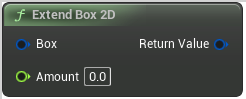

# Extend Box 2D

<figure><figcaption></figcaption></figure>

Extend Box 2D

## Inputs

<table><thead><tr><th width="170">Name</th><th>Description</th></tr></thead><tbody><tr><td>Box</td><td>Extend Box 2D</td></tr><tr><td>Amount</td><td>Extend Box 2D</td></tr></tbody></table>

## Outputs

<table><thead><tr><th width="170">Name</th><th>Description</th></tr></thead><tbody><tr><td>Return Value</td><td>Extend Box 2D</td></tr></tbody></table>
