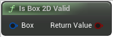

# Is Box 2D Valid

<figure><figcaption></figcaption></figure>

Is Box 2DValid

## Inputs

<table><thead><tr><th width="170">Name</th><th>Description</th></tr></thead><tbody><tr><td>Box</td><td>Is Box 2DValid</td></tr></tbody></table>

## Outputs

<table><thead><tr><th width="170">Name</th><th>Description</th></tr></thead><tbody><tr><td>Return Value</td><td>Is Box 2DValid</td></tr></tbody></table>
