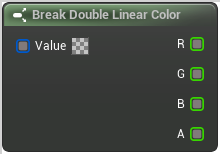

# Break Double Linear Color

<figure><figcaption></figcaption></figure>

Break Double Linear Color

## Inputs

<table><thead><tr><th width="170">Name</th><th>Description</th></tr></thead><tbody><tr><td>Value</td><td>Break Double Linear Color</td></tr></tbody></table>

## Outputs

<table><thead><tr><th width="170">Name</th><th>Description</th></tr></thead><tbody><tr><td>R</td><td>Break Double Linear Color</td></tr><tr><td>G</td><td>Break Double Linear Color</td></tr><tr><td>B</td><td>Break Double Linear Color</td></tr><tr><td>A</td><td>Break Double Linear Color</td></tr></tbody></table>
