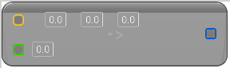

# To Double Linear Color (Vector)

<figure><figcaption></figcaption></figure>

Cast from Vector to Double Linear Color

## Inputs

<table><thead><tr><th width="170">Name</th><th>Description</th></tr></thead><tbody><tr><td>Vector</td><td>Vector to Double Linear Color</td></tr><tr><td>A</td><td>Vector to Double Linear Color</td></tr></tbody></table>

## Outputs

<table><thead><tr><th width="170">Name</th><th>Description</th></tr></thead><tbody><tr><td>Return Value</td><td>Vector to Double Linear Color</td></tr></tbody></table>
