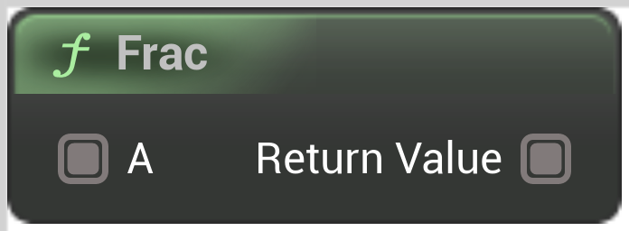

# Frac

<figure><figcaption></figcaption></figure>

Returns the fractional part of a float.

## Inputs

<table><thead><tr><th width="170">Name</th><th>Description</th></tr></thead><tbody><tr><td>A</td><td>A</td></tr></tbody></table>

## Outputs

<table><thead><tr><th width="170">Name</th><th>Description</th></tr></thead><tbody><tr><td>Return Value</td><td>ReturnValue</td></tr></tbody></table>
