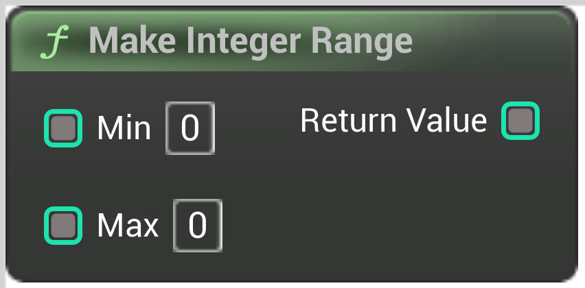

# Make Integer Range

<figure><figcaption></figcaption></figure>

Make Int 32Range

## Inputs

<table><thead><tr><th width="170">Name</th><th>Description</th></tr></thead><tbody><tr><td>Min</td><td>Make Int 32Range</td></tr><tr><td>Max</td><td>Make Int 32Range</td></tr></tbody></table>

## Outputs

<table><thead><tr><th width="170">Name</th><th>Description</th></tr></thead><tbody><tr><td>Return Value</td><td>Make Int 32Range</td></tr></tbody></table>
