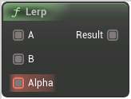

# Lerp

<figure><figcaption></figcaption></figure>

Linearly interpolates between A and B based on Alpha (100% of A when Alpha=0, 100% of B when Alpha=1, 200% of B when Alpha=2)

## Inputs

<table><thead><tr><th width="170">Name</th><th>Description</th></tr></thead><tbody><tr><td>A</td><td>A</td></tr><tr><td>B</td><td>B</td></tr><tr><td>Alpha</td><td>Alpha</td></tr></tbody></table>

## Outputs

<table><thead><tr><th width="170">Name</th><th>Description</th></tr></thead><tbody><tr><td>Result</td><td>Result</td></tr></tbody></table>
