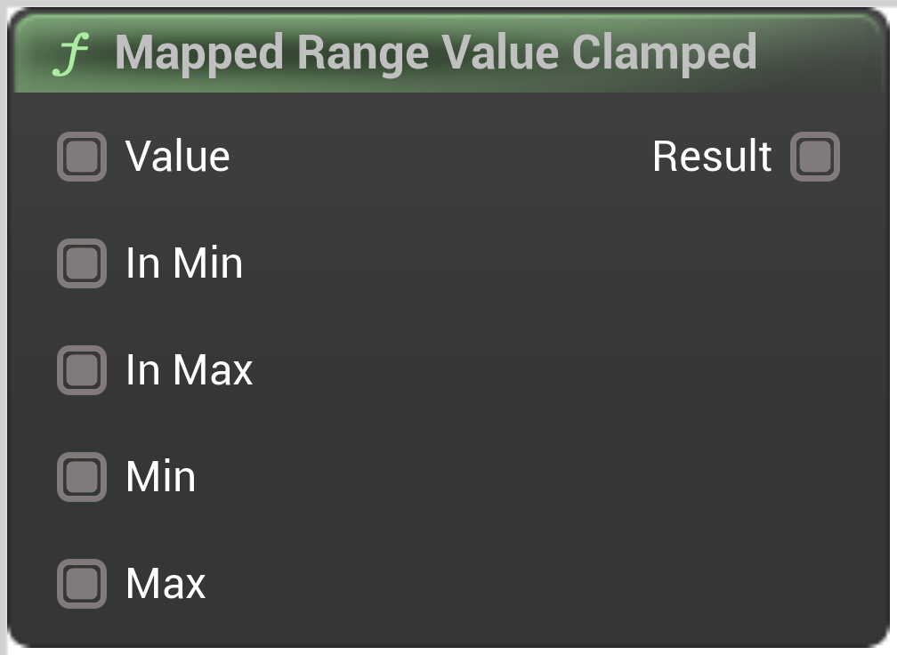

# Mapped Range Value Clamped

<figure><figcaption></figcaption></figure>

For the given Value clamped to the \[InMin:InMax], returns the corresponding percentage in \[OutMin:OutMax]

## Inputs

<table><thead><tr><th width="170">Name</th><th>Description</th></tr></thead><tbody><tr><td>Value</td><td>Value</td></tr><tr><td>In Min</td><td>InMin</td></tr><tr><td>In Max</td><td>InMax</td></tr><tr><td>Out Min</td><td>OutMin</td></tr><tr><td>Out Max</td><td>OutMax</td></tr></tbody></table>

## Outputs

<table><thead><tr><th width="170">Name</th><th>Description</th></tr></thead><tbody><tr><td>Result</td><td>Result</td></tr></tbody></table>
