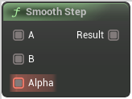

# Smooth Step

<figure><figcaption></figcaption></figure>

Returns a smooth Hermite interpolation between 0 and 1 for the value X (where X ranges between A and B) Clamped to 0 for X <= A and 1 for X >= B

## Inputs

<table><thead><tr><th width="170">Name</th><th>Description</th></tr></thead><tbody><tr><td>A</td><td>A</td></tr><tr><td>B</td><td>B</td></tr><tr><td>Alpha</td><td>Alpha</td></tr></tbody></table>

## Outputs

<table><thead><tr><th width="170">Name</th><th>Description</th></tr></thead><tbody><tr><td>Result</td><td>Result</td></tr></tbody></table>
