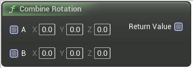

# Combine Rotation

<figure><figcaption></figcaption></figure>

Combine Rotation

## Inputs

<table><thead><tr><th width="170">Name</th><th>Description</th></tr></thead><tbody><tr><td>A</td><td>Combine Rotation</td></tr><tr><td>B</td><td>Combine Rotation</td></tr></tbody></table>

## Outputs

<table><thead><tr><th width="170">Name</th><th>Description</th></tr></thead><tbody><tr><td>Return Value</td><td>Combine Rotation</td></tr></tbody></table>
