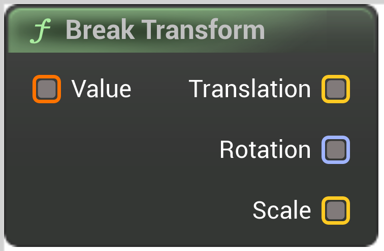

# Break Transform

<figure><figcaption></figcaption></figure>

Break Transform

## Inputs

<table><thead><tr><th width="170">Name</th><th>Description</th></tr></thead><tbody><tr><td>Value</td><td>Break Transform</td></tr></tbody></table>

## Outputs

<table><thead><tr><th width="170">Name</th><th>Description</th></tr></thead><tbody><tr><td>Translation</td><td>Break Transform</td></tr><tr><td>Rotation</td><td>Break Transform</td></tr><tr><td>Scale</td><td>Break Transform</td></tr></tbody></table>
