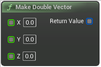

# Make Double Vector

<figure><figcaption></figcaption></figure>

Make Double Vector

## Inputs

<table><thead><tr><th width="170">Name</th><th>Description</th></tr></thead><tbody><tr><td>X</td><td>Make Double Vector</td></tr><tr><td>Y</td><td>Make Double Vector</td></tr><tr><td>Z</td><td>Make Double Vector</td></tr></tbody></table>

## Outputs

<table><thead><tr><th width="170">Name</th><th>Description</th></tr></thead><tbody><tr><td>Return Value</td><td>Make Double Vector</td></tr></tbody></table>
