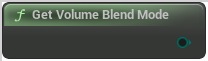

# Get Volume Blend Mode

<figure><figcaption></figcaption></figure>

Get Volume Blend Mode

## Inputs

## Outputs

<table><thead><tr><th width="170">Name</th><th>Description</th></tr></thead><tbody><tr><td>Return Value</td><td>Get Volume Blend Mode</td></tr></tbody></table>
