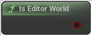

# Is Editor World

<figure><figcaption></figcaption></figure>

Opposite of IsGameWorld: true for editor preview, false for PIE, packaged, standalone...

## Inputs

## Outputs

<table><thead><tr><th width="170">Name</th><th>Description</th></tr></thead><tbody><tr><td>Return Value</td><td>Opposite of IsGameWorld: true for editor preview, false for PIE, packaged, standalone...</td></tr></tbody></table>
