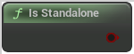

# Is Standalone

<figure><figcaption></figcaption></figure>

Standalone: a game without networking, with one or more local players. Still considered a server because it has all server functionality

## Inputs

## Outputs

<table><thead><tr><th width="170">Name</th><th>Description</th></tr></thead><tbody><tr><td>Return Value</td><td>Standalone: a game without networking, with one or more local players. Still considered a server because it has all server functionality</td></tr></tbody></table>
