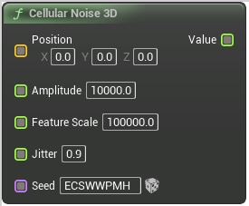

# Cellular Noise 3D

<figure><figcaption></figcaption></figure>

Three dimensional cellular noise

## Inputs

<table><thead><tr><th width="170">Name</th><th>Description</th></tr></thead><tbody><tr><td>Position</td><td>Position at which to calculate output noise</td></tr><tr><td>Amplitude</td><td>Amplitude</td></tr><tr><td>Feature Scale</td><td>FeatureScale</td></tr><tr><td>Jitter</td><td>How irregular the cells are, needs to be between 0 and 1 to avoid glitches</td></tr><tr><td>Seed</td><td>Used to randomize the output noise</td></tr></tbody></table>

## Outputs

<table><thead><tr><th width="170">Name</th><th>Description</th></tr></thead><tbody><tr><td>Value</td><td>Distance to nearest cell center at position</td></tr></tbody></table>
