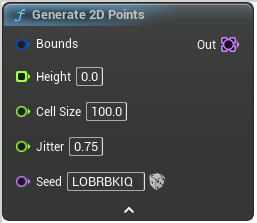

# Generate 2D Points

<figure><figcaption></figcaption></figure>

Generate points on a heightmap

## Inputs

<table><thead><tr><th width="170">Name</th><th>Description</th></tr></thead><tbody><tr><td>Bounds</td><td>Bounds</td></tr><tr><td>Height</td><td>Height</td></tr><tr><td>Cell Size</td><td>A point will be placed in every cell the surface intersects with This is more or less the average distance between points</td></tr><tr><td>Jitter</td><td>Jitter</td></tr><tr><td>Seed</td><td>Seed</td></tr></tbody></table>

## Outputs

<table><thead><tr><th width="170">Name</th><th>Description</th></tr></thead><tbody><tr><td>Out</td><td>Out</td></tr></tbody></table>
