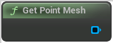

# Get Point Mesh

<figure><figcaption></figcaption></figure>

Voxel Template Node Get Point Mesh

## Inputs

## Outputs

<table><thead><tr><th width="170">Name</th><th>Description</th></tr></thead><tbody><tr><td>Mesh</td><td>Mesh</td></tr></tbody></table>
