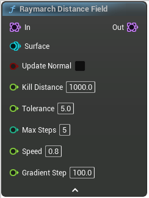

# Raymarch Distance Field

<figure><figcaption></figcaption></figure>

Raymarch Distance Field

## Inputs

<table><thead><tr><th width="170">Name</th><th>Description</th></tr></thead><tbody><tr><td>In</td><td>In</td></tr><tr><td>Surface</td><td>Surface to raymarch</td></tr><tr><td>Update Normal</td><td>If true, will set the new point normal to be the distance field gradient at the refined point positions</td></tr><tr><td>Kill Distance</td><td>If a point is further away than this distance from the surface at the end of the raymarching, it will be removed</td></tr><tr><td>Tolerance</td><td>If a point is within Tolerance distance from the surface, it will be marked as done and won't be raymarched any further</td></tr><tr><td>Max Steps</td><td>Max number of steps to do Keep low for performance</td></tr><tr><td>Speed</td><td>How "fast" to converge to the surface, between 0 and 1 NewPoint = OldPoint + DistanceToSurface * Direction * Speed Decrease if the raymarching is imprecise</td></tr><tr><td>Gradient Step</td><td>Distance between points when sampling gradients</td></tr></tbody></table>

## Outputs

<table><thead><tr><th width="170">Name</th><th>Description</th></tr></thead><tbody><tr><td>Out</td><td>Out</td></tr></tbody></table>
