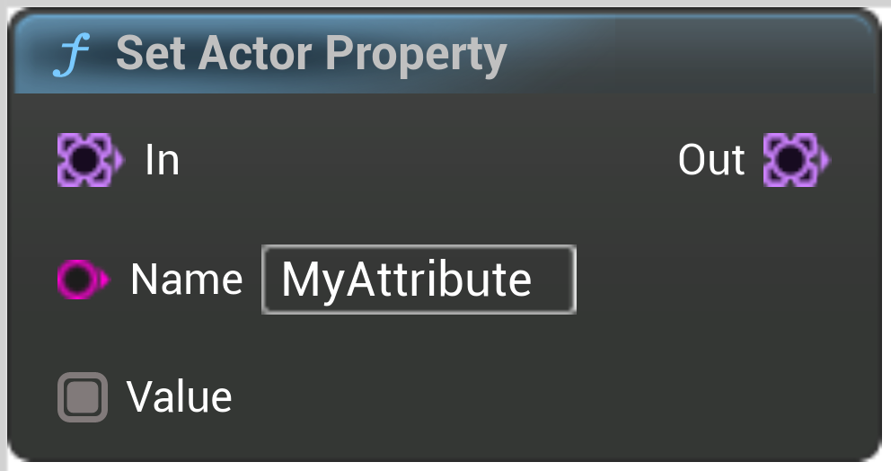

# Set Actor Property

<figure><figcaption></figcaption></figure>

Set a property to be passed to the point actor, per instance

## Inputs

<table><thead><tr><th width="170">Name</th><th>Description</th></tr></thead><tbody><tr><td>In</td><td>In</td></tr><tr><td>Name</td><td>Name</td></tr><tr><td>Value</td><td>Value</td></tr></tbody></table>

## Outputs

<table><thead><tr><th width="170">Name</th><th>Description</th></tr></thead><tbody><tr><td>Out</td><td>Out</td></tr></tbody></table>
