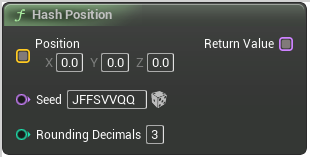

# Hash Position

<figure><figcaption></figcaption></figure>

Create unique seeds from float positions

## Inputs

<table><thead><tr><th width="170">Name</th><th>Description</th></tr></thead><tbody><tr><td>Position</td><td>Create unique seeds from float positions</td></tr><tr><td>Seed</td><td>Create unique seeds from float positions</td></tr><tr><td>Rounding Decimals</td><td>Create unique seeds from float positions</td></tr></tbody></table>

## Outputs

<table><thead><tr><th width="170">Name</th><th>Description</th></tr></thead><tbody><tr><td>Return Value</td><td>Create unique seeds from float positions</td></tr></tbody></table>
