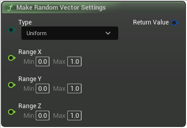

# Make Random Vector Settings

<figure><figcaption></figcaption></figure>

Make Random Vector Settings

## Inputs

<table><thead><tr><th width="170">Name</th><th>Description</th></tr></thead><tbody><tr><td>Type</td><td>Make Random Vector Settings</td></tr><tr><td>Range X</td><td>Make Random Vector Settings</td></tr><tr><td>Range Y</td><td>Make Random Vector Settings</td></tr><tr><td>Range Z</td><td>Make Random Vector Settings</td></tr></tbody></table>

## Outputs

<table><thead><tr><th width="170">Name</th><th>Description</th></tr></thead><tbody><tr><td>Return Value</td><td>Make Random Vector Settings</td></tr></tbody></table>
