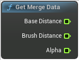

# Get Merge Data

<figure><figcaption></figcaption></figure>

Get MergeSurface data to drive BlendAlpha or BlendBias

## Inputs

## Outputs

<table><thead><tr><th width="170">Name</th><th>Description</th></tr></thead><tbody><tr><td>Base Distance</td><td>BaseDistance</td></tr><tr><td>Brush Distance</td><td>BrushDistance</td></tr><tr><td>Alpha</td><td>Alpha</td></tr></tbody></table>
