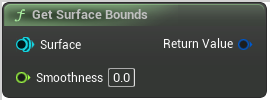

# Get Surface Bounds

<figure><figcaption></figcaption></figure>

Get the bounds of a surface @param Smoothness Bounds will be increased by Smoothness. Should be the same as the SmoothUnion smoothness.

## Inputs

<table><thead><tr><th width="170">Name</th><th>Description</th></tr></thead><tbody><tr><td>Surface</td><td>Get the bounds of a surface @param Smoothness Bounds will be increased by Smoothness. Should be the same as the SmoothUnion smoothness.</td></tr><tr><td>Smoothness</td><td>Bounds will be increased by Smoothness. Should be the same as the SmoothUnion smoothness.</td></tr></tbody></table>

## Outputs

<table><thead><tr><th width="170">Name</th><th>Description</th></tr></thead><tbody><tr><td>Return Value</td><td>Get the bounds of a surface @param Smoothness Bounds will be increased by Smoothness. Should be the same as the SmoothUnion smoothness.</td></tr></tbody></table>
