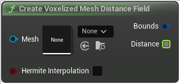

# Create Voxelized Mesh Distance Field

<figure><figcaption></figcaption></figure>

Creates a distance field from a voxelized static mesh @param bHermiteInterpolation Enabling hermite interpolation can lead to higher quality results (less artifacts when interpolating), but is up to 4x more expensive

## Inputs

<table><thead><tr><th width="170">Name</th><th>Description</th></tr></thead><tbody><tr><td>Mesh</td><td>Creates a distance field from a voxelized static mesh @param bHermiteInterpolation Enabling hermite interpolation can lead to higher quality results (less artifacts when interpolating), but is up to 4x more expensive</td></tr><tr><td>B Hermite Interpolation</td><td>Enabling hermite interpolation can lead to higher quality results (less artifacts when interpolating), but is up to 4x more expensive</td></tr></tbody></table>

## Outputs

<table><thead><tr><th width="170">Name</th><th>Description</th></tr></thead><tbody><tr><td>Bounds</td><td>Creates a distance field from a voxelized static mesh @param bHermiteInterpolation Enabling hermite interpolation can lead to higher quality results (less artifacts when interpolating), but is up to 4x more expensive</td></tr><tr><td>Return Value</td><td>Creates a distance field from a voxelized static mesh @param bHermiteInterpolation Enabling hermite interpolation can lead to higher quality results (less artifacts when interpolating), but is up to 4x more expensive</td></tr></tbody></table>
